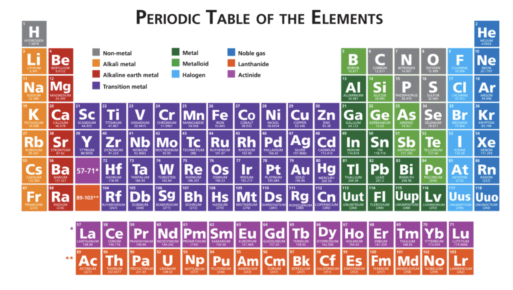

# Periodic Table

### Instructions:

1. Look at the mockup file and use the **HTML TABLE**  to create the periodic table:



2. Use ```CSS selectors: nth-child(), first-child(), last-child(), etc. ``` to add the background colors.

3. **Try to avoid** classes and id's in your HTML.

### Bonuses: 

1. Publish it in GitHub pages. 
2. Share it with your classmates.
3. Make it responsive.


