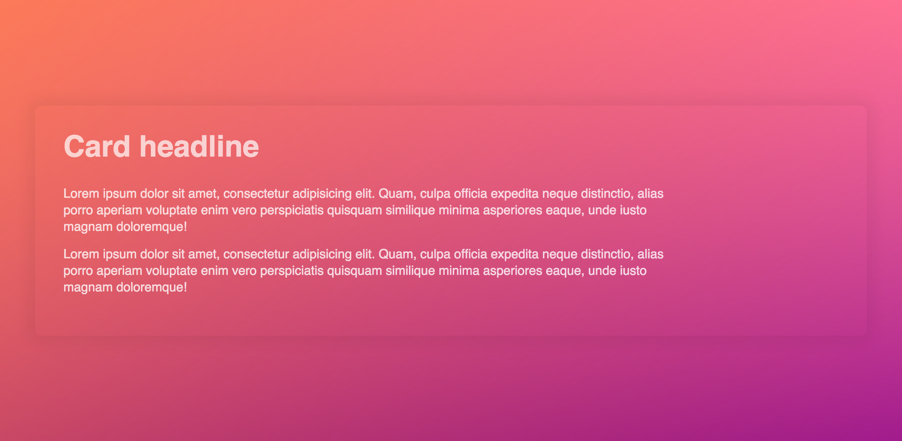

# Elevation

---

Recreate this elevated card effect:

- Which CSS properties do we need to create the 3D effect and color gradience?

- Attempt to make it as pixel-perfect as possible

- Have fun!
